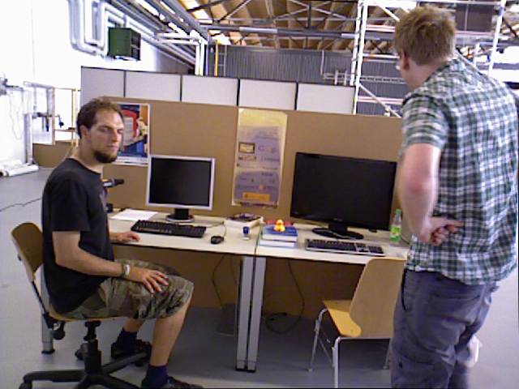
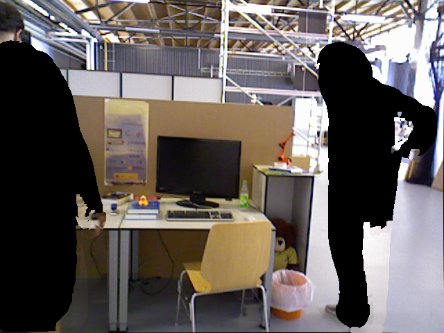
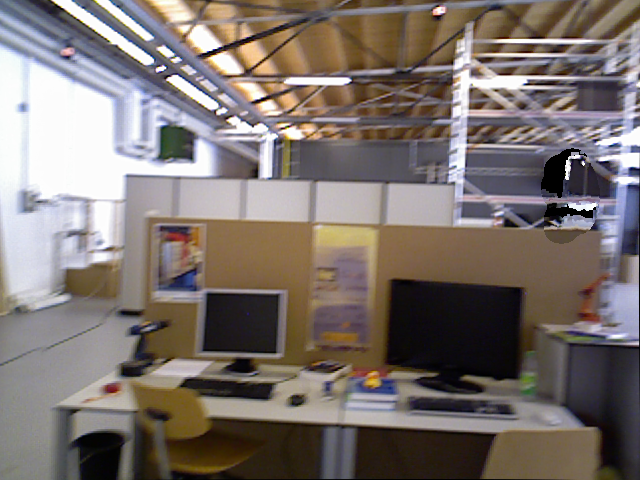

# Vedio Demo

<https://www.bilibili.com/video/av77344939>

# Dependences
-   python: 2.7
-   tensorflow
-   keras: 2.0.8
-   cuda: 9.0
-   OpenCV: 2.4.13

# Prepare
## Kick off docker
```sh
git clone https://github.com/yubaoliu/DynaSLAM.git
cd DynaSLAM/docker
sudo docker-compose build
sudo docker-compose up
```
## Build DynaSLAM
```sh
cd DynaSLAM
chmod +x build.sh
./build.sh
```

# RUN
## Mount dataset folder
``vim docker/.env``:
Modify ``DATASET_DIR``

## Get module
```sh
echo "get mask_rcnn_coco.h5"
cd DynaSLAM/src/python/
wget https://github.com/matterport/Mask_RCNN/releases/download/v2.1/mask_rcnn_balloon.h5 
unzip balloon_dataset.zip
```

## Kick of docker container
```sh
# xhost 控制X server访问权限
xhost +local:root
sudo docker-compose run dynaslam bash
```

## Start DynaSLAM
check run_in_docker.sh

# Results








# Test
## Test tensorflow
```sh
import tensorflow as tf
print(tf.__version__)
```
## Test or Check Mask~RCNN~

```sh
DynaSLAM$ python src/python/Check.py
```

If everything works fun:

```sh
::::
Initialated Mask RCNN network...
Mask R-CNN is correctly working
```
# Tips when building 
##  libprotobuf
Problem:
```sh
[libprotobuf FATAL google/protobuf/stubs/common.cc:61] This program requires version 3.6.0 of the Protocol Buffer runtime library, but the installed version is 2.6.1.  Please update your library.  If you compiled the program yourself, make sure that your headers are from the same version of Protocol Buffers as your link-time library.  (Version verification failed in "external/protobuf_archive/src/google/protobuf/any.pb.cc".)
terminate called after throwing an instance of 'google::protobuf::FatalException'
  what():  This program requires version 3.6.0 of the Protocol Buffer runtime library, but the installed version is 2.6.1.  Please update your library.  If you compiled the program yourself, make sure that your headers are from the same version of Protocol Buffers as your link-time library.  (Version verification failed in "external/protobuf_archive/src/google/protobuf/any.pb.cc".)
Aborted (core dumped)
```
Check Version:

```sh
protoc --version
```
## ndarrayobject.h: No such file or directory
```sh
In file included from /root/DynaSlam/src/Conversion.cc:9:0:
/root/DynaSlam/include/Conversion.h:17:27: fatal error: ndarrayobject.h: No such file or directory
compilation terminated.
CMakeFiles/DynaSLAM.dir/build.make:518: recipe for target 'CMakeFiles/DynaSLAM.dir/src/Conversion.cc.o' failed
make[2]: *** [CMakeFiles/DynaSLAM.dir/src/Conversion.cc.o] Error 1
make[2]: *** Waiting for unfinished jobs....
In file included from /root/DynaSlam/include/MaskNet.h:26:0,
                 from /root/DynaSlam/src/MaskNet.cc:9:
/root/DynaSlam/include/Conversion.h:17:27: fatal error: ndarrayobject.h: No such file or directory
compilation terminated.
```
solution:

```sh
root@710c930fa912:~/DynaSlam/build# find / -name arrayobject.h
/usr/local/lib/python2.7/dist-packages/numpy/core/include/numpy/arrayobject.h
```

# OLD README

Original README.md -&gt; README.md.old

# Another method
```sh
docker pull yubaoliu/cuda-9-cv2:Mask-RCNN

docker run -it --rm \
    -v /home/yubao/data/share:/root \
    -v /home/yubao/data/Dataset:/Dataset \
    --net host \
    --runtime=nvidia \
    -e DISPLAY=$$DISPLAY \
    -v $$HOME/.Xauthority:/root/.Xauthority \
    --name cuda9cv2 \
    yubaoliu/cuda-9-cv2:Mask-RCNN
```

